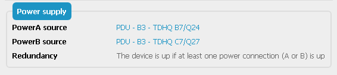
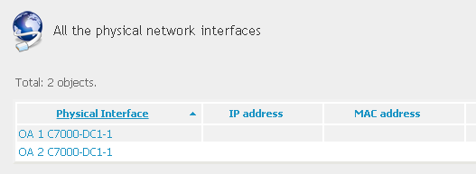

# iTop-Connected-Enclosures
This extension add connection abilities to the iTop enclosure

[TOC]

# Goal

iTop has one CI named Enclosures. This is the kind of 'box' in witch you can add blade servers.

By default, in iTop these enclosures don't have any connection abilities, and you have to connect the power to each internal server (not really representative of the truth, for me)

This extension add the possibility to connect power (with a redundant power access, like for servers), and also to connect network (Mainly for administrative connections)

In the 'Properties' Tab :

And there are the standard 'Network Interfaces' and 'Network Devices' TAB that you can use as for a Server

# Installation
As for all my extensions, just download the zip file, and copy the 'schirrms-...' directory in your extensions directory, then rerun the setup as usual.
